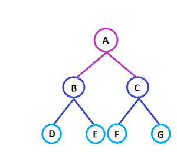

# Learn-DSA 

This is series of learning Dsa help you to get knowledge with the help of codes. 

## Clone/Download  the repo 

Type following command on gitbash or terminal\

```bash 
 git clone https://github.com/Kartikey353/Learn-DSA.git 
 ```
 
 ## introduction  
 
 ### generic Trees  
 
Generic trees are a collection of nodes where each node is a data structure that consists of records and a list of references to its children(duplicate references are not allowed). Unlike the linked list, each node stores the address of multiple nodes. 

There are various ways to store childs of node in generic trees. 
1) linked list
2) arrays 
3) vectors 
 In this repo I used vectors to store tree here is a class representation\ 
 ```C++  
 template <typename T>
 class TreeNode
{
public:
    T data;
    vector<TreeNode<T> *> childreen;
    TreeNode(T data)
    {
        this->data = data;
    }
    void print()
    {
        cout << this->data << " ";
        for (int i = 0; i < this->childreen.size(); i++)
            cout << this->childreen[i]->data << " ";
    }

    void print_level_wise()
    {
        queue<TreeNode<int> *> queuedata;
        queuedata.push(this);
        while (!queuedata.empty())
        {
            cout << queuedata.front()->data << ":";
            for (int i = 0; i < queuedata.front()->childreen.size(); i++)
            {
                cout << queuedata.front()->childreen[i]->data << " , ";
                queuedata.push(queuedata.front()->childreen[i]);
            }
            cout << endl;
            queuedata.pop();
        }
    } 
    ~TreeNode(){
        for(int i=0;i<childreen.size();i++)
        {
            delete childreen[i];
        }
    }
}; 
```  
I used templates you can read more about templates [here](https://cplusplus.com/doc/oldtutorial/templates/).  
1) data : To store data value 
2) Childreen: Vector to child nodes of Data type TreeNode.
3) TreeNode constructor : It asign data value to root Node.
4) print function : It prints root data value and its childreen value data. 
5) Print level wise : It prints data level wise  
    
   
   A: B,C\
   B: D,E\
   C: F,G\
   D:\
   E:\
   F:\
   G:  


## Programms 
1) createTreeandPrint: This will create tree and print tree (in any order but all nodes). 
2) take_input_recursive: This will take input recursively.
3) take_input_level_wise: This will take input level wise as shown above using Queue data structure. 
4) print_level_wise: This will print tree level wise as shown above. 
5) Count_leaf_Nodes: count number of nodes with no child node in tree.
6) Count_no_of_nodes : count total number of nodes in tree.  
7) print_node_at_level_k: print all nodes of tree at depth k. 
8) get_tree_height: Count the height of tree. 
9) post_order: print tree in postorder. 
10) preorder: print tree in pre order. 
11) delete_tree_method1: delete tree using function. 
12) delete_tree_method2: delete tree using destructor. 


## Contributing
Pull requests are welcome. For major changes, please open an issue first to discuss what you would like to change.
Please make sure to update tests as appropriate. 
 
 
## Adding More Helpfull Question: 
You are welcome to add More question in this reprository 
